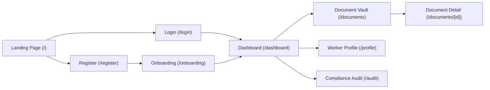
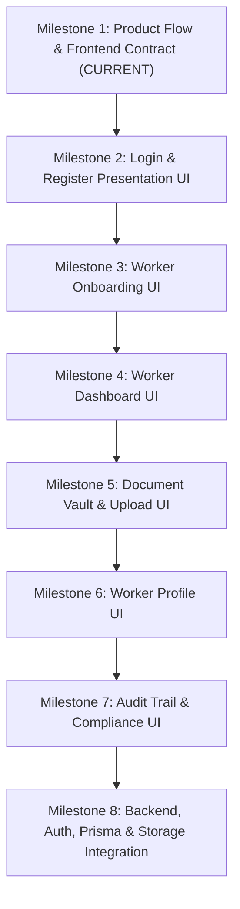

# WorkerDocs — Product Flow & Frontend Contract

This document establishes the official product flow, route contract, page component architecture, and UI specifications for the upcoming WorkerDocs frontend milestones. It serves as the frozen specification for engineering implementation.

---

## 1. Current Product State

As of the current milestone, the WorkerDocs codebase contains a fully verified, production-quality frontend foundation:

* **Public Commercial Landing Page (`/`)**: StaffBeacon-aligned marketing page with 10 dedicated sections, high-fidelity UI mockups (Liam Vance WRK-8921 profile preview, 92% readiness meter), and full responsive layout.
* **Internal Design System Showcase (`/design-system`)**: Interactive component workshop demonstrating all foundational tokens, form controls, status badges, and technical specimen marks. Intentionally unlinked in public navigation.
* **Shared Component Library (`components/shared/`)**:
  * `Logo.tsx`: Canonical brand mark and wordmark with size and variant support.
  * `Header.tsx`: Public responsive navigation with mobile drawer (client leaf).
  * `Footer.tsx`: Public multi-column footer with static copyright and ecosystem attribution.
  * `AppHeader.tsx`: Authenticated worker navigation bar with status capsule.
* **UI Primitive Library (`components/ui/`)**: 13 headless, generic, domain-agnostic components (`Button`, `Card`, `Badge`, `StatusBadge`, `DocumentCard`, `StatCard`, `Input`, `Label`, `Select`, `Textarea`, `Checkbox`, `FileUpload`, `Icons`).
* **Architecture**: Strict Next.js 16 App Router layering where `app/` files are thin route wrappers (<15 lines) delegating to self-contained page directories in `components/pages/`.
* **Rendering Strategy**: React Server Components (RSC) by default; `"use client"` isolated strictly to interactive leaf nodes (`Header` drawer, `FAQ` accordion, `FileUpload` dropzone, `AppHeader` tabs, and `DesignSystemPage`).

> [!IMPORTANT]
> **Current Boundary**: No authentication backend, database, Prisma schema, API route handlers, or file storage pipelines exist in the codebase today. Document records and user profiles currently displayed in the UI are static demonstration mocks.

---

## 2. Primary Worker Journey & Lifecycle

The intended worker journey spans from first discovery through continuous contract readiness:



### Lifecycle Stage Breakdown

| Stage | Route | Purpose | Milestone Status |
|---|---|---|---|
| **1. Discovery** | `/` | Understand value proposition, workflow, and trust model. | **COMPLETE** (Milestone 1) |
| **2. Design Spec** | `/design-system` | Internal component catalog and UI inspection workbench. | **COMPLETE** (Milestone 1) |
| **3. Access** | `/login`, `/register` | Worker entry point: account creation or sign-in. | **COMPLETE** (Milestone 2) |
| **4. Onboarding** | `/onboarding` | Capture core worker details and initial Right to Work status. | **COMPLETE** (Milestone 3) |
| **5. Overview** | `/dashboard` | Central command center: readiness score, required actions, alerts. | **COMPLETE** (Milestone 4) |
| **6. Vault** | `/dashboard/documents` | Full document repository, category filtering, and upload modals. | **COMPLETE** (Milestone 5) |
| **7. Profile** | `/profile` | Worker trade skills, contact info, and verification badge. | **NEXT** (Milestone 6) |
| **8. Audit & Sharing** | `/audit` | Historical verification log and employer access history. | **FUTURE** (Milestone 7) |
| **9. Backend & Database** | Integration | Prisma ORM, PostgreSQL, Auth, S3 storage. | **FUTURE** (Milestone 8) |

---

## 3. Route Contract

Every route in WorkerDocs is defined as a thin App Router segment delegating directly to a dedicated page composition:

```
app/
├── page.tsx                           # [EXISTING] Public Landing Page
├── design-system/page.tsx             # [EXISTING] Internal Design System Showcase
├── login/page.tsx                     # [PROPOSED / NEXT] Worker Sign-In
├── register/page.tsx                  # [PROPOSED / NEXT] Worker Registration
├── onboarding/page.tsx                # [PROPOSED / NEXT] Profile Initialization
├── dashboard/page.tsx                 # [PROPOSED / NEXT] Worker Overview
├── documents/
│   ├── page.tsx                       # [PROPOSED / NEXT] Document Vault
│   └── [id]/page.tsx                  # [PROPOSED / FUTURE] Document Detail
├── profile/page.tsx                   # [PROPOSED / FUTURE] Worker Profile Management
└── audit/page.tsx                     # [PROPOSED / FUTURE] Compliance & Sharing Trail
```

---

## 4. Page Component Contract

Every future page **must** strictly adhere to the established Page-Folder convention:

```
app/<route-name>/page.tsx
        ↓
components/pages/<PageName>Page/
├── <PageName>Page.tsx     # Main page composition
├── <SubcomponentA>.tsx    # Page-specific subcomponent
├── <SubcomponentB>.tsx    # Page-specific subcomponent
└── index.ts               # Barrel export of <PageName>Page
```

### Mandatory Rules
1. **Thin App Router Pages**: `app/<route>/page.tsx` must never contain UI layout, JSX styling, or direct HTML structure. It only defines metadata and imports `<PageNamePage />`.
2. **Naming Alignment**: The page directory (`LoginPage/`), main file (`LoginPage.tsx`), and exported component (`export function LoginPage()`) must match.
3. **Strict Page Isolation**: Supporting subcomponents that only exist on that page (e.g., `LoginForm.tsx`) must live inside that page's folder, **never** in `components/shared/` or `components/ui/`.
4. **Clean Re-export**: `components/pages/<PageName>Page/index.ts` must export the page component so App Router routes can cleanly import via `@/components/pages/<PageName>Page`.

---

## 5. Authentication UI Contract (Frontend Only)

### 5.1 Sign-In Page (`/login`)
* **Page Wrapper**: `app/login/page.tsx`
* **Page Component**: `components/pages/LoginPage/` (`LoginPage.tsx`, `LoginForm.tsx`, `index.ts`)
* **Layout**: Centered card layout on subtle `#FAFAFA` background with canonical `<Logo size="lg" />`.
* **Form Controls**:
  * Email / Worker ID Input (`type="email"`, auto-focus, required).
  * Password Input (`type="password"`, required).
  * "Remember this device" Checkbox (`components/ui/checkbox.tsx`).
  * "Forgot password?" recovery anchor link.
  * Primary Submit Button: `<Button variant="accent" size="lg" className="w-full">Sign In</Button>`.
* **States to Support**:
  * Default empty state.
  * Field-level validation errors (e.g., invalid email format, empty required fields).
  * Submission loading state (`Button` with `isLoading={true}` and spinner).
  * Authentication failure alert banner (e.g., "Invalid credentials entered").
* **Navigation**:
  * Header/Footer: Simplified minimal header with back-to-home link.
  * Footer callout: "Don't have a WorkerDocs profile? **Create your account**" linking to `/register`.

### 5.2 Registration Page (`/register`)
* **Page Wrapper**: `app/register/page.tsx`
* **Page Component**: `components/pages/RegisterPage/` (`RegisterPage.tsx`, `RegisterForm.tsx`, `index.ts`)
* **Layout**: Centered card layout with StaffBeacon ecosystem badge.
* **Form Controls**:
  * Full Legal Name Input (`components/ui/input.tsx`).
  * Primary Trade / Occupation Selector (`components/ui/select.tsx`, e.g., Carpenter, Electrician, Site Manager, General Labourer).
  * Email Address Input (`type="email"`).
  * Password Input (`type="password"`).
  * Confirm Password Input (`type="password"`).
  * Terms & Worker Consent Checkbox: "I confirm my details are accurate and agree to the WorkerDocs Terms of Service and Privacy Policy."
  * Primary Submit Button: `<Button variant="accent" size="lg" className="w-full">Create Worker Profile</Button>`.
* **States to Support**:
  * Password match and minimum length validation.
  * Terms consent required validation.
  * Loading state during submission.
* **Navigation**:
  * Footer callout: "Already have a WorkerDocs profile? **Sign in**" linking to `/login`.

---

## 6. Worker Onboarding Contract (`/onboarding`)

After registration, the worker completes an initial setup sequence before landing on the dashboard.

### 6.1 Field Taxonomy
* **Required Information (Step 1 — Core Details)**:
  * Contact Mobile Number (UK format validation).
  * Primary Postal Address (Street, City, Postcode).
  * Primary Sector / Trade Category (Construction, Rail, Logistics, Healthcare, Facilities).
* **Optional Information (Step 2 — Professional Cards)**:
  * CSCS / Trade Card registration number.
  * Expiration date (if available).
* **Future Information (Deferred to Document Vault / Placement)**:
  * National Insurance Number (NINO).
  * CIS (Construction Industry Scheme) UTR number.
  * Bank disbursement details.

---

## 7. Dashboard Contract (`/dashboard`)

The dashboard serves as the worker's operational command center.

### 7.1 Key Product Surfaces
1. **AppHeader**: Persistent authenticated navigation (`components/shared/AppHeader.tsx`) showing worker name (`Liam Vance`), worker reference code (`WRK-8921`), and "WORK READY" compliance capsule.
2. **Readiness Score Banner**:
   * Prominent readiness percentage metric (e.g., 92% or 80%).
   * Visual progress bar (`role="progressbar"`).
   * Status summary (e.g., "4 of 5 documents verified for site clearance").
3. **Required Actions Panel**:
   * Highlighted cards for documents needing immediate attention (e.g., "Proof of Address Required", "CSCS Renewal Due in 30 Days").
   * Quick-action buttons linking directly to upload/renewal flow.
4. **Summary Metric Grid**:
   * Total Verified Documents (`StatCard` with success indicator).
   * Approaching Renewals (`StatCard` with warning indicator).
   * Active Contract Shares (`StatCard` with neutral indicator).
5. **Recent Document Activity**:
   * Timestamped record of recent uploads and verifications.

---

## 8. Documents Contract (`/documents`)

### 8.1 Document Vault Structure
* **Category Filters**:
  * All Documents (default)
  * Right to Work & Identity
  * Trade Cards & Tickets (CSCS, CPCS, ECS)
  * Qualifications & Diplomas (NVQs, City & Guilds)
  * Health & Safety (First Aid, Asbestos Awareness)
  * Address & Banking Verification
* **Document Card Presentation**:
  * Utilizes `components/ui/document-card.tsx`.
  * Shows document title, issuing authority, reference code, expiration date, and `StatusBadge`.
  * Contextual actions: `View` (preview modal), `Download`, and `Upload` / `Replace`.
* **Upload / Replace Interaction**:
  * Utilizes `components/ui/file-upload.tsx`.
  * Supports drag-and-drop, PDF/PNG/JPG formats up to 15MB.
  * Document expiry date picker input (`components/ui/input.tsx type="date"`).
* **Readiness Relationship**:
  * Adding or renewing a document triggers a dynamic update to the worker's calculated readiness score.

---

## 9. Profile Contract (`/profile`)

### 9.1 Profile Data Model (Frontend Representation)
* **Personal Information**:
  * Full Legal Name (Editable with re-verification note).
  * Email Address (Read-only / verified).
  * Mobile Number (Editable).
  * Residential Address (Editable; requires proof of address if changed).
* **Trade Credentials**:
  * Primary Trade (e.g., "Carpenter & Joiner").
  * Experience Level / Tier.
  * Registered Card Types.
* **Worker Reference Identity**:
  * WorkerDocs Unique ID (e.g., `WRK-8921`, read-only).
  * Account Creation Date.
  * Linked StaffBeacon Agency status.

---

## 10. Design & UX Rules

All future pages must strictly preserve the established WorkerDocs visual identity:
1. **Color Tokens**:
   * StaffBeacon Blue: `#0052FF` (hover `#0047e0`).
   * Deep Slate Typography: `#09090B` / `#18181B`.
   * White Foundation: `#FFFFFF` and subtle muted `#F8FAFC` / `#FAFAFA` surfaces.
   * Hairline Borders: Zinc 200 (`#E4E4E7`) / Gray 150.
2. **Typography**:
   * UI Body & Headlines: `Geist Sans` (`--font-sans`).
   * Codes, Dates, Badges & Labels: `Geist Mono` (`--font-mono`).
3. **Radii & Geometry**:
   * 6px (`rounded-md`), 8px (`rounded-lg`), 12px (`rounded-xl`), 16px (`rounded-2xl`).
   * No heavy pill buttons or bulbous shapes.
4. **Restraint**:
   * No purple AI-style gradients or multi-color shadows.
   * Subtle register marks (`tech-crosshair-container`) used sparingly as technical accents.

---

## 11. Server / Client Boundary Rules

To ensure fast initial page loads, optimal SEO, and small client bundles:

```
Route Page (app/**/page.tsx) ──────> [Server Component]
  └── Page Layout (HomePage, DashboardPage) ──> [Server Component]
        ├── Static Visual Cards & Banners ────> [Server Component]
        └── Interactive Leaf (Forms, Modals) ─> ["use client"]
```

* **Server Component by Default**: Every page wrapper, layout, and static section remains a Server Component.
* **Client Leaf Nodes Only**: Mark a component with `"use client"` **only** if it uses:
  * React state hooks (`useState`, `useReducer`).
  * Lifecycle hooks (`useEffect`, `useLayoutEffect`).
  * Interactive browser APIs (DragEvent, FileList, window listeners).
  * Interactive form validation requiring immediate client feedback.

---

## 12. Scope Protection (Explicit Non-Goals)

The following backend capabilities are **strictly out of scope** for frontend milestones and will be addressed in dedicated backend integration phases:
* **No Database**: No Prisma schemas, migrations, seed scripts, or direct PostgreSQL connections.
* **No Authentication Backend**: No NextAuth/Auth.js, JWT generation, bcrypt hashing, or session cookies.
* **No File Storage Backend**: No AWS S3, Cloudflare R2, or local disk uploads.
* **No API Route Handlers**: No `/api/*` endpoints.
* **No External Webhooks**: No StaffBeacon live webhooks or automated third-party verification checks.

---

## 13. Recommended Implementation Sequence

Following the approval of this contract, frontend development will proceed in ordered, testable milestones:



| Milestone | Deliverables | Architectural Focus |
|---|---|---|
| **Milestone 1** | `docs/PRODUCT_FLOW.md` | Frozen frontend specification and contract definition. |
| **Milestone 2** | `/login` & `/register` UI | `LoginPage/` and `RegisterPage/` with interactive client forms and error states. |
| **Milestone 3** | `/onboarding` UI | `OnboardingPage/` multi-step setup sequence. |
| **Milestone 4** | `/dashboard` UI | `DashboardPage/` with readiness score banner, required document alerts, and metric cards. |
| **Milestone 5** | `/documents` UI | `DocumentsPage/` with category filters, document cards, and upload/replace modal. |
| **Milestone 6** | `/profile` UI | `ProfilePage/` with personal and trade information management. |
| **Milestone 7** | `/audit` UI | `AuditPage/` with verification history and credential sharing controls. |
| **Milestone 8** | Backend & Database | Prisma ORM, PostgreSQL schema, session authentication, S3 file storage, and StaffBeacon API. |

